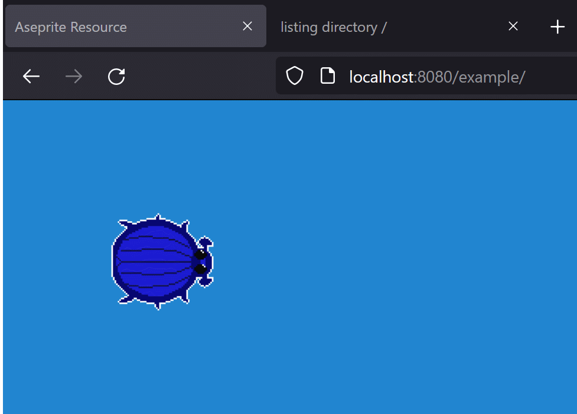

# Aseprite Plugin For Excalibur

This extension adds support for [Aseprite](https://www.aseprite.org/) SpriteSheets and Animations exported to json or the native `.aseprite` file format.

* Supports RGBA, Grayscale, and Indexed Sprites!
* Supports opacity on cells and layers!
* Supports tagged animations!

```
> npm install @excaliburjs/plugin-aseprite
```

1. Use the native `.aseprite` file format or using export json the [aseprite cli](https://www.aseprite.org/docs/cli/) or through the UI.


2. Load the Aseprite resource and voila ✨
  - Use `AsepriteResource.getAnimation(name)` to retrieve animations by the name in aseprite
  - Use `AsepriteResource.getSpriteSheet()` to get the equivalent Excalibur SpriteSheet

## Example:

```typescript
import { AsepriteResource } from "@excaliburjs/plugin-aseprite";

const game = new Engine({
    width: 600,
    height: 400,
    displayMode: DisplayMode.FitScreen
});

// Native
const asepriteSpriteSheet = new AsepriteResource('./beetle.aseprite');
// Or JSON export
// const asepriteSpriteSheet = new AsepriteResource('./beetle.json');

const loader = new Loader([asepriteSpriteSheet]);
game.start(loader).then(() => {

    const anim = asepriteSpriteSheet.getAnimation('Loop');
    const actor = new Actor({pos: vec(100, 100)});
    actor.graphics.use(anim);
    
    game.currentScene.add(actor);
});
```



## Example exporting JSON in the UI


## Contributing

- Built with webpack 5
- Uses webpack-dev-server

To start development server:

    npm start

To watch:

    npm run watch

To compile only:

    npm run build

To run tests:

    npx playwright install
    npm test

To update snapshots

* Windows

   ```powershell
   npx playwright test --update-snapshots
   ```

* Linux for CI

   ```powershell
   docker run --rm --network host -v C:\projects\excalibur-aseprite:/work/ -w /work/ -it mcr.microsoft.com/playwright:v1.43.1-jammy /bin/bash
   npm install
   npx playwright test --update-snapshots
   ```


## Currently unsupported in the Native format

PRs welcome to address!

* Layer blend modes
* Tilesets
* User Data
* External files
* Color Profiles